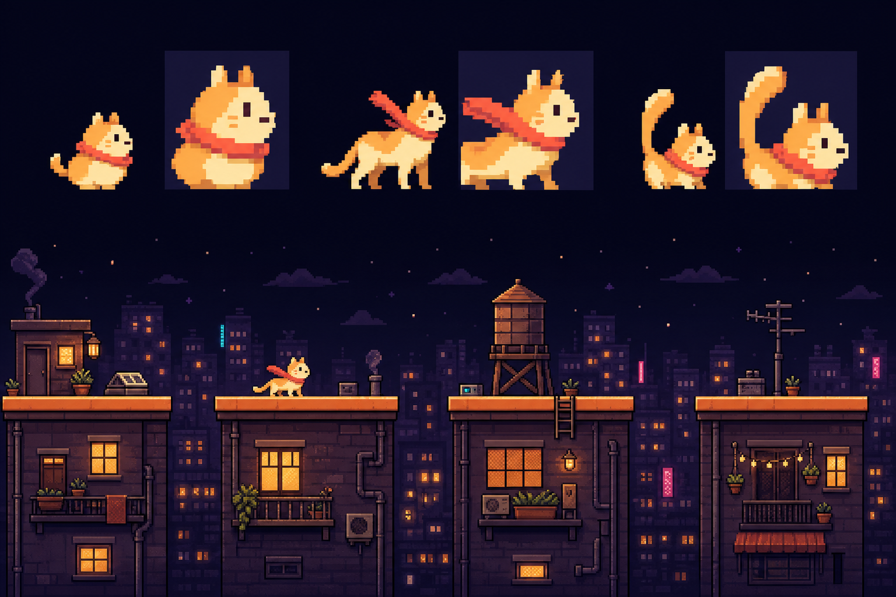

# M3 概念板与方向记录

生成日期：2026-07-18  
用途：视觉开发参考，不进入生产构建  
生成方式：OpenAI 内置图像生成工具



## 方向选择

- 主角采用第一版的圆润豆形品牌感，加上第二版更清楚的侧向奔跑四肢。
- 保留短耳、奶油橘身体、单侧眼睛和向后飘的珊瑚围巾。
- 尾巴使用中等尺寸，拒绝第三版过大的竖直尾巴，避免小尺寸下抢过身体。
- 场景保留暖窗、深紫城市和少量粉/青霓虹，但生产画面降低约一档细节密度。
- 屋檐的连续暖色顶边被采纳；背景所有长横线必须降低对比度，避免伪装成平台。

## 最终生成提示词

```text
Use case: stylized-concept
Asset type: original visual development concept board for a web pixel-art rooftop runner game; reference only, not a final sprite sheet
Primary request: create one polished pixel-art concept board that compares three distinct side-view silhouette directions for the same small cream-orange cat hero with a coral scarf, and demonstrates the chosen warm cyber-city rooftop visual hierarchy in a wide gameplay scene below
Composition/framing: landscape concept board; upper band shows three evenly spaced cat silhouette explorations at true small-game scale with larger nearest-neighbor zoom callouts behind or beside each, no labels or text; lower band is a wide side-view rooftop gameplay scene showing the cat, four separated playable rooftops, clear gaps, layered skyline, warm windows, one water tank, one antenna, subtle steam, and restrained neon accents; keep generous separation between the character studies and scene
Character variants: first is round bean-shaped with short ears and compact tail; second is slightly athletic with longer legs and swept scarf; third is compact and expressive with a large balancing tail; all must remain original and clearly feline, readable around 26 by 28 pixels, no resemblance to existing commercial game characters
Style/medium: authentic handcrafted pixel art, crisp hard pixel clusters, 2-pixel design grid, no anti-aliasing, no vector smoothness, no painterly texture, no 3D
Lighting/mood: warm, cozy, inhabited future city at night; adventurous but not dystopian
Color palette: only deep ink #0C0B1C, night purple #17162F, dark violet #312856 and #493252, cream #FFF5D6 and #FFF0C4, warm yellow #FFCF71, cat orange #F6C26B, roof orange #F0A45E, amber #D89061, coral #DF665C, tiny restrained cyan #72D7D0 and pink #E985B5 accents
Gameplay clarity constraints: the cat is the highest-priority silhouette; every playable roof has a continuous bright 6-pixel-equivalent top edge; gaps are unmistakable; background horizontal lines must not resemble platforms; background contrast stays low; neon cyan and pink together occupy under 8 percent of the image; show a wide desktop composition without stretching sprites
Constraints: completely original visual design; no text, letters, numbers, logos, UI, watermark, border, or copyrighted character references; no violence; no excessive neon; no giant buildings covering the playable view
Avoid: generic cyberpunk rain, photorealism, anime rendering, smooth gradients on sprites, blurry pixels, isometric view, front-facing cat, duplicated limbs, inconsistent pixel scale
```

## 使用边界

该概念板是生成式视觉参考，不被拆分、裁切或直接作为游戏素材。正式精灵和场景由项目内 Canvas/像素网格重新制作，并继续遵守 `ART_DIRECTION.md` 和素材清单的审核规则。
